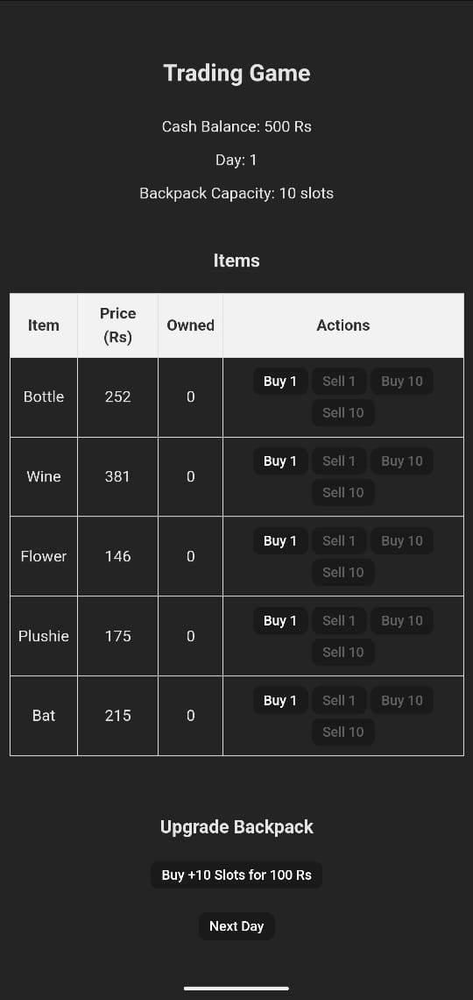

`# Trading Game

A simple, mobile-friendly trading game built with React. Players buy and sell various items whose prices fluctuate daily, aiming to maximize their cash balance within 30 days. The game features backpack capacity upgrades and a public high scores leaderboard.



## Table of Contents

- [Features](#features)
- [Demo](#demo)
- [Getting Started](#getting-started)
 - [Prerequisites](#prerequisites)
 - [Installation](#installation)
- [Environment Variables](#environment-variables)
- [Running the Application](#running-the-application)
- [High Scores](#high-scores)
- [Technologies Used](#technologies-used)
- [Contributing](#contributing)
- [License](#license)

## Features

- **Buy and Sell Items**: Trade up to 5 different items with prices fluctuating between ₹50 and ₹500 daily.
- **Backpack Upgrades**: Increase your backpack capacity by purchasing additional slots. Upgrades can be done up to 20 times, each costing 2x the previous upgrade.
- **30-Day Gameplay**: Make strategic trades over 30 days to maximize your cash balance.
- **Responsive Design**: Optimized for mobile devices to ensure a seamless gaming experience.
- **High Scores Leaderboard**: Submit your name and score to a public leaderboard, displaying the top 10 scores.
- **Last Purchase Notification**: See a message indicating the last item you purchased, including its name, price, and quantity.

## Demo

[https://trade-game.skdev.one]

## Getting Started

Follow these instructions to set up and run the project locally.

### Prerequisites

- **Node.js** (v14 or higher)
- **npm** (v6 or higher) or **yarn**

### Installation

1. **Clone the Repository**

   ```bash
   git clone https://github.com/rsumit123/trade-game.git
   cd trade-game `

1.  **Install Dependencies**

    Using npm:

    bash

    Copy code

    `npm install`

    Or using yarn:

    bash

    Copy code

    `yarn install`

Environment Variables
---------------------

The project uses environment variables to manage dynamic item names and interact with the JSONBin.io API for high scores. Create a `.env` file in the root directory of your project with the following variables:

env

Copy code

`# .env
VITE_ITEM_NAMES=Item Alpha,Item Bravo,Item Charlie,Item Delta,Item Echo
VITE_JSONBIN_API_KEY=your_jsonbin_api_key
VITE_JSONBIN_BIN_ID=your_jsonbin_bin_id`

-   **VITE_ITEM_NAMES**: Comma-separated list of item names (up to 5).
-   **VITE_JSONBIN_API_KEY**: Your JSONBin.io API key.
-   **VITE_JSONBIN_BIN_ID**: The ID of your JSONBin.io bin where high scores are stored.

**Note**: Never expose your API keys in public repositories. Ensure your `.env` file is included in `.gitignore`.

Running the Application
-----------------------

Start the development server:

Using npm:

bash

Copy code

`npm run dev`

Or using yarn:

bash

Copy code

`yarn dev`

The application will be available at `http://localhost:5173` (default Vite port). If port 5173 is occupied, Vite will suggest an alternative.

High Scores
-----------

High scores are managed using [JSONBin.io](https://jsonbin.io/). Upon game completion, players can submit their name and score, which are stored in a public JSON bin. The leaderboard displays the top 10 scores.

### Setting Up JSONBin.io

1.  **Create an Account**: Sign up at [JSONBin.io](https://jsonbin.io/) and verify your email.
2.  **Create an API Key**: Generate a new API key from your dashboard.
3.  **Create a Bin**:
    -   Initialize the bin with an empty array: `[]`.
    -   Set **Read Access** to public and **Write Access** to private.
    -   Note down the **Bin ID**.

### Integrating with the App

Ensure that your `.env` file includes the `VITE_JSONBIN_API_KEY` and `VITE_JSONBIN_BIN_ID` variables as shown above.

Technologies Used
-----------------

-   **React**: Frontend library for building user interfaces.
-   **Vite**: Fast frontend build tool.
-   **Axios**: Promise-based HTTP client for the browser.
-   **JSONBin.io**: Online JSON storage service for managing high scores.
-   **CSS**: Styling the application with responsive design principles.

Contributing
------------

Contributions are welcome! Please follow these steps:

1.  **Fork the Repository**

2.  **Create a Feature Branch**

    bash

    Copy code

    `git checkout -b feature/YourFeature`

3.  **Commit Your Changes**

    bash

    Copy code

    `git commit -m "Add some feature"`

4.  **Push to the Branch**

    bash

    Copy code

    `git push origin feature/YourFeature`

5.  **Open a Pull Request**

License
-------

This project is licensed under the MIT License.